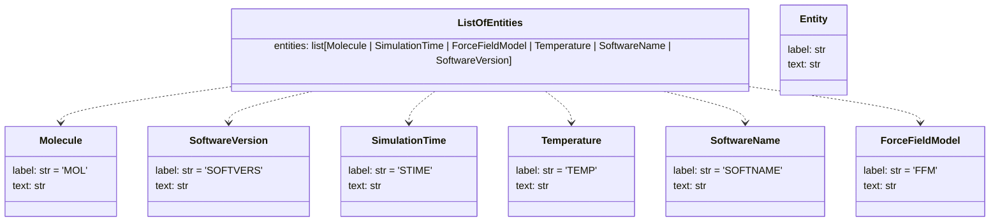

# LLM Prompting for Molecular Dynamics Named Entity Recognition (MDNER)

## Introduction


This project explores methods for reliably annotating dataset descriptions and scientific texts related to Molecular Dynamics (MD).  Because Large Language Models (LLMs) are inherently non-deterministic, we aim to enforce structured and reproducible outputs using a strict [Pydantic](https://docs.pydantic.dev/1.10/) schema. Below is a Mermaid diagram that summarizes the schema used to capture detected entities:




To assess robustness and accuracy, we benchmark several LLMs (GPT-5, Gemini 3 Pro, etc.) together with extraction libraries such as **Instructor**, **LlamaIndex**, and **Pydantic**.   Our goal is to identify the best model–framework combinations for accurate, consistent, and schema-compliant Molecular Dynamics Named Entity Recognition (MDNER).


## Setup environment

We use [uv](https://docs.astral.sh/uv/getting-started/installation/)
to manage dependencies and the project environment.

Clone the GitHub repository:

```sh
git clone git@github.com:MDverse/mdner_llm.git
cd mdner_llm
```

Sync dependencies:

```sh
uv sync
```

---
## Add OpenAI and OpenRouter API key

Create an .env file with a valid [OpenAI](https://platform.openai.com/docs/api-reference/authentication) and [OpenRouter](https://openrouter.ai/docs/api/reference/authentication) API key:

```sh
OPENAI_API_KEY=<your-openai-api-key>
OPENROUTER_API_KEY=<your-openrouter-api-key>
```
> Remark: This .env file is ignored by git.

---
## Utilities

### 1. Format JSON annotations

To format old json annotations, run:

```sh
uv run src/format_json_annotations.py
```

This command processes all JSON files in `annotations/v1`, reformats the entities with their text and exact positions, and saves the formatted files to `annotations/v2`.


### 2. Correct JSON annotations

To vizualize the corrections of json annotations, open the notebook in `notebooks/correct_and_vizualize_annotations.ipynb`.


### 3. Count entities per class for each annotation

To perform statistics on the distribution of annotations per files and class, run:

```sh
uv run src/count_entities.py --annotations-dir annotations/v2
```

This command processes all JSON files listed, counts the number of entities per class for each annotation, and outputs a TSV file with the filename, text length, and entity counts per class.

This command will also produce plots with class distribution for all entities and entity distribution by class.


### 4. Quality Control Inventory of Named Entities

To generate a QC inventory of named entities from annotation files, run:

```sh
uv run src/qc_entity_inventory.py \
    --annot-folder annotations/v2 \
    --out-folder results/qc_annotations
```

This command will scan all JSON annotations, aggregate and normalize entities per class, count their occurrences, and save one vocabulary file per class in the output folder. 
> 💡 Running a QC inventory on annotation files ensures that all entities are 
consistently aggregated and normalized. This is a crucial step for 
defining **annotation rules in molecular dynamics**, helping standardize 
formats, units, and naming conventions. The generated files can be 
explored in [`notebooks/qc_entity_inventory_explorer.ipynb`](notebooks/qc_entity_inventory_explorer.ipynb) 
and the rules are documented in [`docs/annotation_rules.md`](docs/annotation_rules.md).


---
