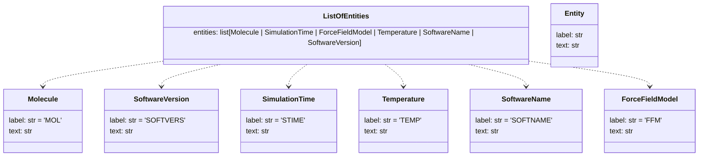

# LLM Prompting for Molecular Dynamics Named Entity Recognition (MDNER)

## Introduction

This project explores methods for automatically annotating dataset descriptions and scientific texts related to Molecular Dynamics (MD).

## Annotation dataset

A dataset of about 280 annotated texts is available in the `annotations` folder.
These texts are build from the title and description of molecular dynamics simulation datasets scraped from Zenodo and Figshare.

These texts have been manually annotated with [annotation rules](docs/annotation_rules.md).

## Using large language models

Because Large Language Models (LLMs) are inherently non-deterministic, we aim to enforce structured and reproducible outputs using a strict [Pydantic](https://docs.pydantic.dev/1.10/) schema. Below is a Mermaid diagram that summarizes the schema used to capture detected entities:


```mermaid
classDiagram
    class ListOfEntities {
        entities: list[Molecule | SimulationTime | ForceFieldModel | Temperature | SoftwareName | SoftwareVersion]
    }

    class SoftwareVersion {
        label: str = 'SOFTVERS'
        text: str
    }

    class Temperature {
        label: str = 'TEMP'
        text: str
    }

    class SimulationTime {
        label: str = 'STIME'
        text: str
    }

    class Molecule {
        label: str = 'MOL'
        text: str
    }

    class SoftwareName {
        label: str = 'SOFTNAME'
        text: str
    }

    class ForceFieldModel {
        label: str = 'FFM'
        text: str
    }

    class Entity {
        label: str
        text: str
    }

    ListOfEntities ..> Molecule
    ListOfEntities ..> SoftwareVersion
    ListOfEntities ..> SimulationTime
    ListOfEntities ..> Temperature
    ListOfEntities ..> SoftwareName
    ListOfEntities ..> ForceFieldModel
```

To assess robustness and accuracy, we benchmark several LLMs (GPT-5, Gemini 3 Pro, etc.) together with extraction libraries such as **Instructor**, **LlamaIndex**, and **Pydantic**. Our goal is to identify the best model–framework combinations for accurate, consistent, and schema-compliant Molecular Dynamics Named Entity Recognition (MDNER).

## Setup environment

We use [uv](https://docs.astral.sh/uv/getting-started/installation/)
to manage dependencies and the project environment.

Clone the GitHub repository:

```sh
git clone git@github.com:MDverse/mdner_llm.git
cd mdner_llm
```

Sync dependencies:

```sh
uv sync
```

## Add OpenAI and OpenRouter API key

Create an .env file with a valid [OpenAI](https://platform.openai.com/docs/api-reference/authentication) and [OpenRouter](https://openrouter.ai/docs/api/reference/authentication) API key:

```sh
OPENAI_API_KEY=<your-openai-api-key>
OPENROUTER_API_KEY=<your-openrouter-api-key>
```

> Remark: This .env file is ignored by git.

## Perform quality control and explore annotation dataset

Perform quality control on manually annotated entities:

```sh
$ uv run validate-annotations --annotations-dir data/annotations
2026-04-10 15:36:46 | INFO     | Validating all annotations in directory: data/annotations.
2026-04-10 15:36:46 | INFO     | Found 372 JSON files to validate.
2026-04-10 15:36:47 | INFO     | Total text mismatches: 0
2026-04-10 15:36:47 | INFO     | Total span mismatches: 0
2026-04-10 15:36:47 | INFO     | Total overlapping entities: 0
2026-04-10 15:36:47 | INFO     | Total removed entities: 0
2026-04-10 15:36:47 | INFO     | Total entities with invalid boundaries: 0
2026-04-10 15:36:47 | INFO     | Total unknown categories: 0
2026-04-10 15:36:47 | SUCCESS  | Validation completed successfully!
```

Make the inventory of all entities:

```sh
$ uv run build-entity-inventory --annotation-path data/groundtruth_paths.txt --out-path data/entities.tsv
2026-04-08 15:29:25 | INFO     | Starting entity inventory.
2026-04-08 15:29:25 | INFO     | Collecting entities.
2026-04-08 15:29:25 | INFO     | Reading list of JSON files from data/groundtruth_paths.txt.
2026-04-08 15:29:25 | SUCCESS  | Found 109 JSON files successfully.
2026-04-08 15:29:25 | SUCCESS  | Collected 1708 entities
2026-04-08 15:29:25 | INFO     | Writing entity inventory TSV file.
2026-04-08 15:29:25 | SUCCESS  | Saved entity inventoryin: data/entities.tsv
2026-04-08 15:29:25 | SUCCESS  | Entity inventory completed successfully!
```

A list of entities per category can be found in [notebooks/review/explore_entities_from_inventory.ipynb](notebooks/review/explore_entities_from_inventory.ipynb).

## Usage

### Extract entities of one text 📃

To extract structured entities from a single text using a specified LLM ([from OpenRouter available models]((https://openrouter.ai/models))) and framework, run :

```sh
uv run extract-entities \
    --text-path data/annotations/figshare_121241.json \
    --model openai/gpt-5.2 \
    --framework instructor
```
> This command generates two outputs: a `.txt` file containing the raw LLM response, and a `.json` file containing the extracted entities along with metadata about the extraction (model, framework, input file, and run details).


```
# TXT output example:
{
  "entities": [
    {
      "label": "MOL",
      "text": "Phosphatidylcholine"
    },
    {
      "label": "MOL",
      "text": "1,2-diauroyl-sn-glycero-3-phospocholine"
    },
    {
      "label": "MOL",
      "text": "DLPC"
    },
    {
      "label": "MOL",
      "text": "DMPC"
    },
    {
      "label": "MOL",
      "text": "DPPC"
    },
    {
      "label": "FFM",
      "text": "AMBER"
    }
  ]
}
```
```json
# JSON output example:
{
    "timestamp": "2026-04-10T16:34:26.459776+00:00",
    "json_path": "data/annotations/figshare_121241.json",
    "text": "<text content of the dataset description>",
    "url": "<url of the dataset description page>",
    "model_name": "openai/gpt-5.2",
    "framework_name": "none",
    "prompt_path": "json_few_shot.txt",
    "prompt_tag": "json",
    "groundtruth": "<ground-truth entities string>",
    "raw_llm_response": "<raw LLM response string>",
    "llm_response": "<Parsed LLM response string>",
    "inference_time_sec": 2.540970104979351,
    "inference_cost_usd": 0.003835,
    "response_file": "results/llm/annotations/figshare_121241_openai_gpt-5.2_none_2026-04-10_T16-34-26.txt"
}
```

### Extract entities for multiple texts 📑

To extract structured entities from multiple dataset descriptions listed in [results/100_selected_md_dataset_description_paths.txt](results/100_selected_md_dataset_description_paths.txt), execute:

```sh
uv run extract-entities-all-texts \
    --texts-path data/groundtruth_paths.txt \
    --model openai/gpt-5.2 \
    --framework instructor
```

### Evaluate LLM annotations ⚖️

To evaluate the quality of annotations produced by LLMs and different framework, run:

```sh
uv run evaluate-llm-and-framework \
        --annotations-dir results/llm/annotations \
        --results-dir results/llm/evaluation_stats
```

> This command loads all LLM-generated JSON files in results/llm/annotations, computes per-annotation metrics against the ground-truth, and saves the results in results/llm/evaluation_stats. It generates an Excel file with overall metrics for each entity class, and a parquet file with detailed annotation results for each test sample and each label.

## Train Gliner2 model on Molecular Dynamics annotations

To train the Gliner2 model on the Molecular Dynamics annotations, run:

```sh
uv run train-gliner --config-path src/mdner_llm/gliner/training_config.yaml
```

> This command trains the Gliner2 model using the configuration specified in [src/mdner_llm/gliner/training_config.yaml](src/mdner_llm/gliner/training_config.yaml) and save the trained model with the best validation performance.


## Evaluate Gliner2 models

To evaluate the performance of the trained Gliner2 model or on a test set of annotations, run:

```sh
uv run evaluate-gliner \
    --model-name gliner2_base_large \
    --model-path fastino/gliner2-large-v1 \
    --test-dataset data/gliner/test.jsonl \
    --test-metadata-path data/gliner/test_metadata.txt
```

> This command evaluates the specified Gliner2 model on the test dataset provided in `data/gliner/test.jsonl`. It computes evaluation metrics such as precision, recall, and F1-score for each entity class. It saves the annotation results (per test sample and per labels) into a parquet file, and generates a summary Excel file with overall metrics for each entity class.
