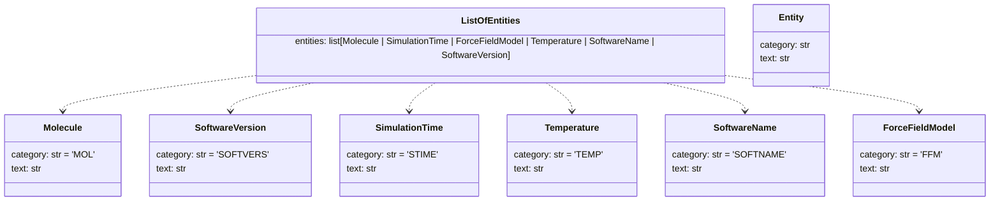

# LLM Prompting for Molecular Dynamics Named Entity Recognition (MDNER)

## Introduction

This project explores methods for automatically annotating dataset descriptions and scientific texts related to Molecular Dynamics (MD).

## Annotation dataset

A dataset of about 374 annotated texts is available in the `annotations` folder.
These texts are build from the title and description of molecular dynamics simulation datasets scraped from Zenodo and Figshare.

These texts have been manually annotated with [annotation rules](docs/annotation_rules.md).

## Using large language models

Because Large Language Models (LLMs) are inherently non-deterministic, we aim to enforce structured and reproducible outputs using a strict [Pydantic](https://docs.pydantic.dev/1.10/) schema. Below is a Mermaid diagram that summarizes the schema used to capture detected entities:


```mermaid
classDiagram
    class ListOfEntities {
        entities: list[Molecule | SimulationTime | ForceFieldModel | Temperature | SoftwareName | SoftwareVersion]
    }

    class SoftwareVersion {
        category: str = 'SOFTVERS'
        text: str
    }

    class Temperature {
        category: str = 'TEMP'
        text: str
    }

    class SimulationTime {
        category: str = 'STIME'
        text: str
    }

    class Molecule {
        category: str = 'MOL'
        text: str
    }

    class SoftwareName {
        category: str = 'SOFTNAME'
        text: str
    }

    class ForceFieldModel {
        category: str = 'FFM'
        text: str
    }

    class Entity {
        category: str
        text: str
    }

    ListOfEntities ..> Molecule
    ListOfEntities ..> SoftwareVersion
    ListOfEntities ..> SimulationTime
    ListOfEntities ..> Temperature
    ListOfEntities ..> SoftwareName
    ListOfEntities ..> ForceFieldModel
```

To assess robustness and accuracy, we benchmark several LLMs (GPT-5, Gemini 3 Pro, Claude Sonnet 4.6, GLM 5.1, etc.) together with extraction libraries such as **Instructor** and **Pydantic**. Our goal is to identify the best model–framework combinations for accurate, consistent, and schema-compliant Molecular Dynamics Named Entity Recognition (MDNER).

## Setup environment

We use [uv](https://docs.astral.sh/uv/getting-started/installation/)
to manage dependencies and the project environment.

Clone the GitHub repository:

```sh
git clone git@github.com:MDverse/mdner_llm.git
cd mdner_llm
```

Sync dependencies:

```sh
uv sync
```

## Add OpenAI and OpenRouter API key

Create an .env file with a valid [OpenAI](https://platform.openai.com/docs/api-reference/authentication) and [OpenRouter](https://openrouter.ai/docs/api/reference/authentication) API key:

```sh
OPENAI_API_KEY=<your-openai-api-key>
OPENROUTER_API_KEY=<your-openrouter-api-key>
```

> Remark: This .env file is ignored by git.

## Perform quality control and explore annotation dataset

Perform quality control on manually annotated entities:

```sh
$ uv run validate-annotations --annotations-dir data/annotations
2026-04-10 15:36:46 | INFO     | Validating all annotations in directory: data/annotations.
2026-04-10 15:36:46 | INFO     | Found 374 JSON files to validate.
2026-04-10 15:36:47 | INFO     | Total text mismatches: 0
2026-04-10 15:36:47 | INFO     | Total span mismatches: 0
2026-04-10 15:36:47 | INFO     | Total overlapping entities: 0
2026-04-10 15:36:47 | INFO     | Total removed entities: 0
2026-04-10 15:36:47 | INFO     | Total entities with invalid boundaries: 0
2026-04-10 15:36:47 | INFO     | Total unknown categories: 0
2026-04-10 15:36:47 | SUCCESS  | Validation completed successfully!
```

Make the inventory of all entities:

```sh
$ uv run build-entity-inventory --annotation-path data/groundtruth_paths.txt --out-path data/entities.tsv
2026-04-08 15:29:25 | INFO     | Starting entity inventory.
2026-04-08 15:29:25 | INFO     | Collecting entities.
2026-04-08 15:29:25 | INFO     | Reading list of JSON files from data/groundtruth_paths.txt.
2026-04-08 15:29:25 | SUCCESS  | Found 109 JSON files successfully.
2026-04-08 15:29:25 | SUCCESS  | Collected 1708 entities
2026-04-08 15:29:25 | INFO     | Writing entity inventory TSV file.
2026-04-08 15:29:25 | SUCCESS  | Saved entity inventoryin: data/entities.tsv
2026-04-08 15:29:25 | SUCCESS  | Entity inventory completed successfully!
```

A list of entities per category can be found in [notebooks/explore_entities_from_inventory.ipynb](notebooks/explore_entities_from_inventory.ipynb).

## Usage

### Extract entities of one text 📃

To extract structured entities from a single text using a specified LLM ([from OpenRouter available models]((https://openrouter.ai/models))) and framework, run :

```sh
uv run extract-entities-with-llm \
    --text-path data/annotations/figshare_121241.json \
    --model openai/gpt-5.2 \
    --framework instructor
2026-04-22 00:12:22 | INFO     | Starting the extraction of entities.
2026-04-22 00:12:22 | DEBUG    | Loading text and metadata from data/annotations/figshare_121241.json.
2026-04-22 00:12:22 | DEBUG    | Loaded text (1710 chars): Modeling of Arylamide Helix Mimetics in the p53 Peptide Binding Site...
2026-04-22 00:12:22 | DEBUG    | Loading prompt from json_few_shot.txt.
2026-04-22 00:12:22 | DEBUG    | Loaded prompt (6685 chars) : # Named-Entity Recognition task  ## Role definition  You are a highly speci...
2026-04-22 00:12:22 | DEBUG    | Starting annotation with model openai/gpt-4o using instructor.
2026-04-22 00:12:25 | DEBUG    | Response status: ok.
2026-04-22 00:12:25 | DEBUG    | Formatted LLM response: 
                                 entities=[ForceField(category='FFM', text='GAFF'), SoftwareName(category='SOFTNAME', text='AutoDock'), SimulationTime(category='STIME', text='20 ns')]
2026-04-22 00:12:25 | DEBUG    | Inference time: 2.6673661249951692 seconds.
2026-04-22 00:12:25 | DEBUG    | Input tokens: 3236.
2026-04-22 00:12:25 | DEBUG    | Output tokens: 70.
2026-04-22 00:12:25 | DEBUG    | Cost usage: 0.00623 $.
2026-04-22 00:12:25 | DEBUG    | Saved raw response successfully.
2026-04-22 00:12:25 | DEBUG    | Saved formated response with metadata successfully.
2026-04-22 00:12:25 | SUCCESS  | Completed the extraction of entities successfully!
```
> This command generates two outputs: a `.txt` file containing the raw LLM response, and a `.json` file containing the extracted entities along with metadata about the extraction (model, framework, input file, and run details).

```
# Output example:
{
  "entities": [
    {
      "category": "MOL",
      "text": "Phosphatidylcholine"
    },
    {
      "category": "MOL",
      "text": "1,2-diauroyl-sn-glycero-3-phospocholine"
    },
    {
      "category": "MOL",
      "text": "DLPC"
    },
    {
      "category": "MOL",
      "text": "DMPC"
    },
    {
      "category": "MOL",
      "text": "DPPC"
    },
    {
      "category": "FFM",
      "text": "AMBER"
    }
  ]
}
```

### Extract entities for multiple texts 📑

To extract structured entities from multiple dataset descriptions listed in [data/groundtruth_paths.txt](data/groundtruth_paths.txt), execute:

```sh
uv run extract-entities-with-llm-all-texts \
    --texts-path data/groundtruth_paths.txt \
    --model openai/gpt-5.2 \
    --framework instructor
```


### Fine-tune Gliner2 on Molecular Dynamics annotations 🚀

To train the Gliner2 model on the Molecular Dynamics annotations, run:

```sh
uv run train-gliner --config-path src/mdner_llm/gliner/training_config.yaml
```

> This command trains the Gliner2 model using the configuration specified in [src/mdner_llm/gliner/training_config.yaml](src/mdner_llm/gliner/training_config.yaml) and save the trained model with the best validation performance.


### Evaluate extraction performance ⚖️

To evaluate the quality of annotations produced by LLMs and different framework, run:

```sh
uv run evaluate-entities-extraction \
        --annotations-dir results/llm/annotations \
        --results-dir results/llm/evaluation_stats
```

> This command loads all LLM-generated JSON files in results/llm/annotations, computes per-annotation metrics against the ground-truth, and saves the results in results/llm/evaluation_stats. It generates an csv file with overall metrics for each entity class, and a parquet file with detailed annotation results for each test sample and each category.


A comparison of the performance of different LLMs/Gliner2 models and frameworks can be found in [notebooks/compare_models_performance.ipynb](notebooks/compare_models_performance.ipynb).

