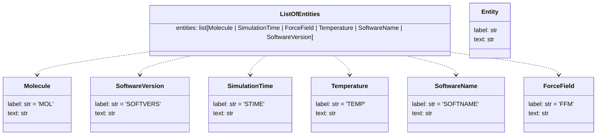

```mermaid
classDiagram


    class ListOfEntities {
        entities: list[Molecule | SimulationTime | ForceField | Temperature | SoftwareName | SoftwareVersion]
    }

    class SoftwareVersion {
        label: str = 'SOFTVERS'
        text: str
    }

    class Temperature {
        label: str = 'TEMP'
        text: str
    }


    class SimulationTime {
        label: str = 'STIME'
        text: str
    }

    class Molecule {
        label: str = 'MOL'
        text: str
    }


    class SoftwareName {
        label: str = 'SOFTNAME'
        text: str
    }

    class ForceField {
        label: str = 'FFM'
        text: str
    }

    class Entity {
        label: str
        text: str
    }

    ListOfEntities ..> Molecule
    ListOfEntities ..> SoftwareVersion
    ListOfEntities ..> SimulationTime
    ListOfEntities ..> Temperature
    ListOfEntities ..> SoftwareName
    ListOfEntities ..> ForceField
  
```