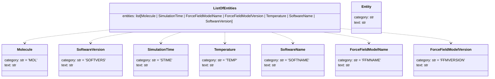

# Output Models for LLM NER Tasks 📑

[Pydantic](https://docs.pydantic.dev/latest/) data models used to structure the output of LLM NER tasks.

This module defines strongly typed entity classes representing different kinds of annotations
extracted from scientific Molecular Dynamics (MD) texts, such as molecules, simulation times,
force fields, and software names.

Each entity subclass uses Python's `Literal` type for its `category` field to enforce strict typing.
This ensures that only the correct entity type can be assigned, preventing misclassification
(e.g., a force field entity cannot be assigned to a Molecule class). All entities share the
base fields `category` and `text`.

## Models

### [`ListOfEntities`](entities.py)

A Pydantic model representing a list of `Entity` instances.Each `Entity` contains:

- `category`: short code identifying the entity type (e.g., `"MOL"`, `"STIME"`).
- `text`: exact substring extracted from the source text.

### [`ListOfEntitiesPositions`](entities_with_positions.py)

A Pydantic model representing a list of `EntityWithPosition` instances.Each `EntityWithPosition` contains:

- `category`: short code identifying the entity type.
- `text`: exact substring.
- `start`: start index in the source text.
- `end`: end index in the source text.

Useful when you need to retain the exact location of entities for downstream tasks like highlighting.
